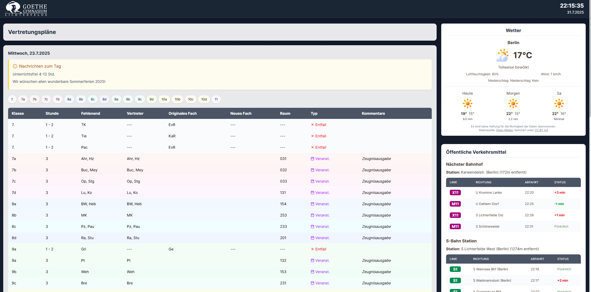
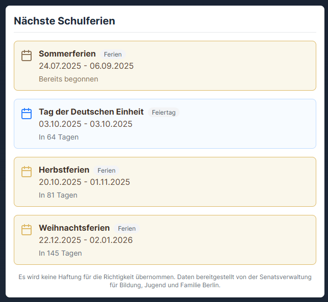
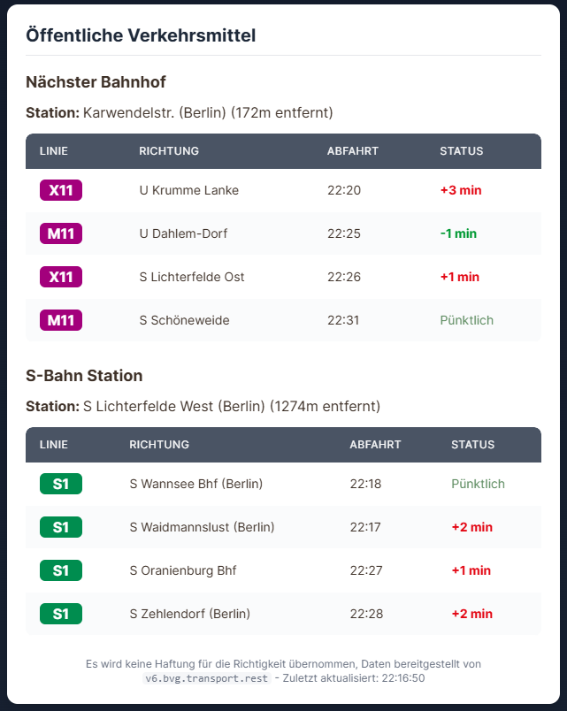
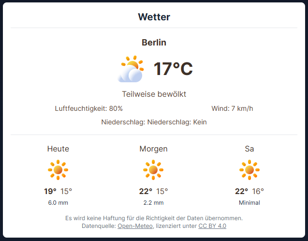

# 🏫 School Dashboard


[](https://www.react.doctor/share?p=frontend&s=96&w=14&f=7)

> A modern, intuitive dashboard designed originally for Goethe Gymnasium Lichterfelde (GGL) to transform the lobby information display into a comprehensive school information hub.

## 📖 Overview

The School Dashboard was created to replace the outdated and clumsy substitution plan display in the lobby of Goethe Gymnasium Lichterfelde. Built with React and Spring Boot, it provides a centralized hub for students, teachers, and staff to access critical updates throughout the school day with a clean, responsive design.

While developed specifically for GGL, this application is designed to be adaptable for any school using the DSBmobile system for substitution plans.

---

## 📸 Screenshots

<div align="center">
  <div style="display: flex; flex-wrap: wrap; justify-content: center; gap: 10px; margin-bottom: 20px;">
    <div style="flex-basis: 100%;">
      <h3>Overview</h3>
      
    </div>
  </div>
  <div style="display: flex; flex-wrap: wrap; justify-content: center; gap: 0px;">
    <div style="flex-basis: 25%;">
      <h3>Holiday Module</h3>
      
    </div>
    <div style="flex-basis: 25%;">
      <h3>Calendar Module</h3>
      
    </div>
    <div style="flex-basis: 25%;">
      <h3>Transportation Module</h3>
      
    </div>
    <div style="flex-basis: 25%;">
      <h3>Weather Module</h3>
      
    </div>
  </div>
</div>

---
## ✨ Features

### Current Features

- **📋 Substitution Plan Integration**
  - Real-time connection to DSBmobile API
  - Clear, organized display of class changes
  - Cached updates for performance optimization

- **🌤️ Weather Forecasts**
  - Current conditions and temperature
  - Daily forecast visualization
  - Open-Meteo API integration for accurate data

- **🚌 Transportation Schedules**
  - Real-time bus and train departures
  - Route information and delays
  - Nearest stop information
  - BVG API integration for Berlin transportation data

- **⏰ Live Clock**
  - Current time and date display
  - Visual time tracking

- **📊 School Event Calendar**
  - Upcoming events visualization
  - Important dates and deadlines
  - Integration of any iCal calendar

- **🏖️ Upcoming Holiday display**
  - Display of upcoming holidays for Berlin
  - Data provided by "Senatsverwaltung für Bildung, Jugend und Familie Berlin"

### 🔄 Planned Features

- **📱 Mobile Responsiveness**
  - Optimize display for various device sizes
  - Touch-friendly interface for tablets

- **🔔 Notification System**
  - Important announcements and alerts
  - Customizable notifications based on user preferences

- **🎨 Customizable Themes**
  - Light/dark mode toggle
  - School color integration

---

## 🛠️ Technical Implementation

### Frontend

- TanStack Start (React 19) with TypeScript
- TanStack Router (file-based routing)
- Tailwind CSS for styling
- Vite + Nitro adapter for development and production builds

### Backend

- Spring Boot 3.2 Java backend
- RESTful API design
- Caching for performance optimization

## 🧰 API Integration Challenges

The integration with DSBmobile API was a significant challenge in this project. We initially attempted implementation using various Python libraries, which resulted in:

- 8+ hours of troubleshooting authentication issues
- Inconsistent data payloads
- Undocumented API changes

After these frustrations, we discovered and implemented a 6-year-old Java library that perfectly handles the DSBmobile integration. This discovery was a breakthrough moment for our project, enabling us to finally move forward with the core functionality.

> 💡 **Lesson Learned**: Sometimes the best solution isn't the newest one. The robust Java implementation from 2018 outperformed modern alternatives.

### 😤 The DSBmobile Struggle

Working with DSBmobile has been an exercise in frustration due to heinekingmedia's approach to their platform:

- **No Public API**: Despite being used by thousands of schools, there's no official, documented API for developers
- **Zero Transparency**: Changes to the backend occur without warning, breaking third-party integrations
- **Artificial Barriers**: Simple data that should be easily accessible is obscured behind proprietary interfaces

This opacity has forced us to rely on reverse-engineered solutions, creating unnecessary technical debt and development delays for what should be a straightforward integration.

---

## 🚀 Getting Started

## Development

### Prerequisites

- JDK 21
- Node.js 24+ and pnpm (enable via `corepack enable`)
- Maven (only needed once to bootstrap Maven Wrapper if wrapper files are missing)

### Installation

TL;DR:

```bash
git clone https://github.com/Zzacklack/school-dashboard.git
cd school-dashboard
pnpm run setup
pnpm run dev
```

`pnpm run setup` now includes an interactive credential/URL bootstrap and writes:

- `Backend/.env` (backend secrets and Spring env overrides)
- `Frontend/.env` (frontend backend target URL)

These files are local-only and must never be committed.

### Backend (Spring Boot)

The monorepo helper scripts prefer Maven Wrapper (`Backend/mvnw` / `Backend/mvnw.cmd`) and fall back to system Maven if wrapper files are missing.
Backend uses a single committed config file: `Backend/src/main/resources/application.properties`.
Every runtime value is read from environment variables (with safe defaults where appropriate).

- **Install dependencies + local env bootstrap**

  ```bash
  pnpm run setup
  ```

  If you need to regenerate credentials/URLs later, run:

  ```bash
  pnpm run setup:env
  ```

 You can override any Spring property using environment variables (Spring Boot relaxed binding).
  Examples:
  - `DSB_USERNAME` -> `dsb.username`
  - `DSB_PASSWORD` -> `dsb.password`
  - `CALENDAR_ICS_URL` -> `calendar.ics-url`
  - `SPRING_DATASOURCE_URL` -> `spring.datasource.url`
  - `SERVER_SERVLET_SESSION_COOKIE_SECURE` -> `server.servlet.session.cookie.secure`

- **Database migrations** – Flyway runs automatically on startup. Migration scripts live under `Backend/src/main/resources/db/migration`. To apply new schema changes, add a `V{next}__description.sql` file and restart the backend.

- **Start the dev server** (hot reload, no jar required)

  ```bash
  mvn spring-boot:run
  ```

- **Run tests**

  ```bash
  mvn test
  ```

- **Build an executable jar** (skips tests for faster iteration)

  ```bash
  mvn clean package -DskipTests
  ```

  The H2 database persists plan snapshots under `Backend/data/`.

### Backend API Endpoints

All endpoints are served from the backend base URL (default: `http://localhost:8080`).

- `GET /health` - Lightweight health response with status + timestamp.
- `GET /api/substitution/plans` - Substitution plan data (cached fallback on errors).
- `GET /api/dsb/timetables` - Raw DSBmobile timetables list.
- `GET /api/dsb/news` - DSBmobile news payload.
- `GET /api/calendar/events?limit=5` - Parsed calendar events (epoch millis + `allDay`).
- `GET /error` - Error page handler (HTML).

If actuator endpoints are enabled (see `management.endpoints.web.exposure.include`), you can also use:

- `GET /actuator/health`
- `GET /actuator/info`
- `GET /actuator/metrics`
- `GET /actuator/env`

### Frontend (TanStack Start)

- **Install dependencies**

  ```bash
  pnpm install --frozen-lockfile
  ```

  `Frontend/.env` is generated by `pnpm run setup` and used automatically by Vite.

- **Start the dev server**

  ```bash
  pnpm --dir Frontend run dev
  ```

- **Run checks**

  ```bash
  pnpm --dir Frontend run build   # production bundle
  pnpm --dir Frontend run lint    # optional lint pass
  pnpm --dir Frontend run test:unit
  pnpm --dir Frontend run test:integration
  pnpm --dir Frontend run test:web
  ```

### Code Quality and CI/CD

- **Formatting**
  - Backend: Spotless (`mvn -f Backend/pom.xml spotless:check`)
  - Frontend: Prettier (`pnpm --dir Frontend run format:check`)
- **Linting**
  - Frontend: ESLint (`pnpm --dir Frontend run lint`)
- **CI/CD**
  - GitHub Actions workflows for CI, CodeQL, and Docker image publishing

Monorepo helpers from the repo root:

```bash
pnpm run format:check
pnpm run format
pnpm run lint
pnpm run test
pnpm run build
```

### Access the application

- Frontend: <http://localhost:3000>
- Backend API: <http://localhost:8080>

### Cloudflare Workers (Frontend Only)

This repository now supports deploying only `Frontend/` with Wrangler (Cloudflare Workers static assets):

- Wrangler config: `Frontend/wrangler.toml`
- Production domain: `goethe-dashboard.zacklack.de`
- Preview URLs: enabled via `preview_urls = true` and `workers_dev = true`

Cloudflare-managed build/deploy (Workers Builds):

1. In Cloudflare Workers, connect the GitHub repository.
2. Build settings:
   - Root directory: repository root (`/`)
   - Build command: `pnpm --dir Frontend run build:workers`
   - Deploy command: `pnpm --dir Frontend run deploy:workers`
   - Non-production branch deploy command: `pnpm --dir Frontend run deploy:workers:preview`

## Production

### Prerequisites

- Docker
- Docker Compose

### Configuration

1. **Configure the Backend**:

- Provide required credentials through environment variables (e.g. add a `.env` file in the `Docker/` directory or inject values in your CI/CD system). Typical variables include `DSB_USERNAME`, `DSB_PASSWORD`, and any optional Spring overrides.
- Persistent storage for the H2 database is already wired via the `backend-data` volume (mounted at `/data`). Create regular backups of this volume if the substitution history is important for you.
- If you upgraded from Spring Boot 2.x to 3.x, H2 requires a one-time file format migration. Set `H2_MIGRATE_ON_STARTUP=true` for the backend container to auto-migrate the file on startup (creates a `.bak` and `.sql` export in `/data`).

2. **Configure the Frontend**:

- Set `BACKEND_URL` for the frontend runtime (for example `http://backend:8080` in Docker Compose). The TanStack Start server routes under `/api/*` forward requests to this backend origin.

### Deployment Steps

1. **Build the Docker Images**:

  ```bash
  cd Docker
  docker compose -f docker-compose.yaml build
  ```

2. **Run the Application with Docker Compose**:

  ```bash
  docker compose -f docker-compose.yaml up -d
  ```

  This command builds the images and starts the containers in detached mode.

### Verification

1. **Check Container Status**:

  ```bash
  docker compose -f docker-compose.yaml ps
  ```

  Verify that both the frontend and backend containers are running without issues.

2. **Access the Application**:

  Open your browser and navigate to the domain or IP address where your application is deployed.

### HTTPS Configuration (Optional)

If you need HTTPS, you can configure Traefik (or another reverse proxy) to handle SSL termination. Here’s an example using Traefik labels in your `docker-compose.yaml`:

```yaml
frontend:
  # ... other configurations ...
  labels:
  - "traefik.enable=true"
  - "traefik.http.routers.school-dashboard-secure.rule=Host(`your-domain.com`)"
  - "traefik.http.routers.school-dashboard-secure.entrypoints=https"
  - "traefik.http.routers.school-dashboard-secure.tls.certresolver=letsencrypt"
```

Make sure Traefik is properly configured to use Let's Encrypt for SSL certificate generation.

---

## 📝 Development Status

This project is currently under active development. The core functionality is implemented, but we're working on:

- Design refinements and UI/UX improvements
- Additional feature implementations
- Performance optimizations
- Comprehensive testing

## 💡 Why We Built This

The existing solution for displaying the substitution plan at GGL was:

- Visually outdated and difficult to read
- Limited to showing only substitution information
- Not responsive or adaptable to different screen sizes
- Unable to display other important information for students and staff

Our dashboard solves these problems by providing a modern, readable interface that combines substitution plans with weather, transportation, and other useful information in one unified display.

## 🔄 Development Roadmap

| Phase | Focus | Status |
|-------|-------|--------|
| 1 | Core API Integration & Basic UI | ✅ Done |
| 2 | Enhanced UI & Additional Features | 🔄 In Progress |
| 3 | Testing & Performance Optimization | 🔄 In Progress |
| 4 | Deployment & Documentation | 🧩 Partially done |
| 5 | User Feedback & Iteration | 🔜 Planned |
| 6 | Final Review & Launch | 🔜 Planned |

---

## 🤝 Contributing

Contributions are welcome! While this project was created for GGL, we've designed it to be adaptable for any school. Please feel free to submit a Pull Request.

See [CONTRIBUTING.md](CONTRIBUTING.md) for detailed guidelines.

1. Fork the repository
2. Create your feature branch (`git checkout -b feature/amazing-feature`)
3. Commit your changes (`git commit -m 'Add some amazing feature'`)
4. Push to the branch (`git push origin feature/amazing-feature`)
5. Open a Pull Request

## 📄 License

This project is licensed under the BSD 3-Clause License - see the [LICENSE](LICENSE) file for details.

## 🙏 Acknowledgements

- [DSBmobile-API](https://github.com/Sematre/DSBmobile-API) by [Sematre](https://github.com/Sematre/) for the Java implementation
- [BVG-API](https://v6.bvg.transport.rest/) for the Berlin transportation data
- [Open-Meteo](https://open-meteo.com/) for the weather data
- [Weather-Sense/Icons](https://github.com/Leftium/weather-sense) by [Leftium](https://github.com/Leftium/) for the weather icons
- All contributors who have invested their time into making this project better
  - Special thanks to [Saloking (Nikolas)](https://github.com/nikolas-bott) for giving me the idea to use the Java API instead of Python ones
- Goethe Gymnasium Lichterfelde for the opportunity to improve the school's information system

---

<p align="center">
  Made with ❤️ for improving school information systems, starting with GGL
</p>
